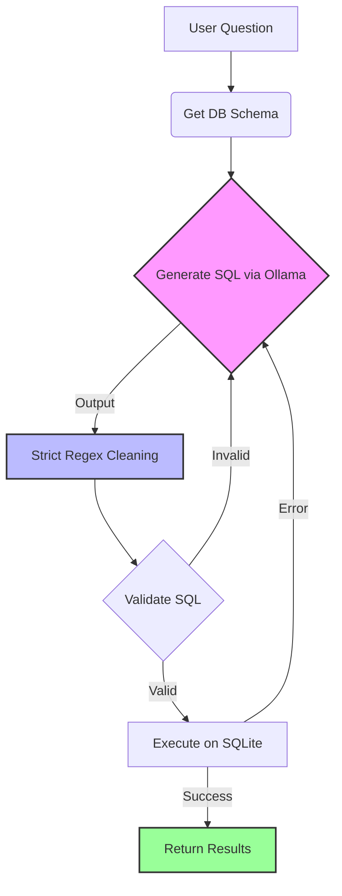

---

# 🏥 Medical AI Analytics Backend (Local & Private)

A **privacy-first** backend for medical analytics. This system provides a prescription adherence dashboard and a powerful **Text-to-SQL AI Agent** that allows doctors/admins to query patient data using natural language—all running **100% locally** without external API costs.

---

## ⚡ Key Features

* **🔒 Privacy First**: No patient data leaves your machine. The AI (Llama 3.2) runs locally via Ollama.
* **🧠 Agentic SQL Generation**: Uses **LangGraph** to fetch schemas, generate SQL, validate queries, and auto-correct errors before execution.
* **🛡️ Ultra-Safe Execution**: Includes regex-based SQL cleaning and strict validation to prevent dangerous queries (DROP, DELETE, UPDATE).
* **📊 Adherence Dashboard**: auto-calculates patient risk scores based on prescription refill gaps.
* **🔌 Auto-Bootstrap**: Automatically imports CSV data (`patients.csv`, `clinical_notes.csv`, etc.) into SQLite on startup.

---

## 🏗️ Architecture

The system uses a **LangGraph** state machine to ensure reliable SQL generation.



---

## 🚀 Getting Started

### 1. Prerequisites

* **Python 3.10+**
* **Ollama**: [Download here](https://ollama.com/)
* **Data**: Ensure you have your CSV files in a `data/` folder.

### 2. Install Dependencies

Create a `requirements.txt` file (or just install directly):

```bash
pip install fastapi uvicorn langchain-ollama langchain-community langgraph pydantic sqlite3

```

### 3. Setup Local AI Model

This project uses **Llama 3.2** for its speed and accuracy in SQL generation.

```bash
# Start Ollama service (if not running)
ollama serve

# Pull the model
ollama pull llama3.2

```

### 4. Folder Structure

Ensure your project looks like this so the auto-importer works:

```text
/project-root
│
├── app.py                # The main FastAPI backend
├── medical_records.db    # Auto-generated by app.py
│
└── data/                 # PLACE YOUR CSVs HERE
    ├── clinics.csv
    ├── patients.csv
    ├── clinical_notes.csv
    └── prescriptions.csv

```

---

## 🏃‍♂️ Usage

### Start the Server

Run the backend. It will automatically find an open port (defaulting to 8000).

```bash
python app.py

```

*You will see logs indicating "Bulk import finished" if it's the first run.*

### Access the API

Open your browser to the auto-generated Swagger UI:
👉 **http://localhost:8000/docs**

---

## 🧪 Example Queries (AI Chatbot)

Send a POST request to `/api/query` with a JSON body: `{"question": "..."}`.

| Question Type | Example Query |
| --- | --- |
| **Patient Counts** | *"How many patients are assigned to Dr. Abbott?"* |
| **Trend Analysis** | *"Count the number of Diabetes diagnoses in December 2025."* |
| **Risk Assessment** | *"List patients who have missed their refill for Metformin."* |
| **Clinic Stats** | *"Which clinic has the most patients on 'Active' prescriptions?"* |

---

## 🛠️ Troubleshooting

**1. "Ollama not detected" error:**

* Ensure the Ollama app is running in the background.
* Run `ollama list` in your terminal to confirm `llama3.2` is installed.

**2. "Table not found" errors:**

* Check that your `data/` folder exists and contains the CSV files **before** running `app.py`.
* Delete `medical_records.db` and restart the app to trigger a fresh import.

**3. AI gives "Empty SQL" or weird output:**

* The system includes a retry mechanism (max 3 tries). If it fails, try making your question more specific (e.g., specify "current year" or specific doctor names).

---

## 📜 License

* **Code**: MIT License

* **Data**: Ensure your CSV data complies with HIPAA/GDPR regulations. This tool is for analytics and research purposes.
